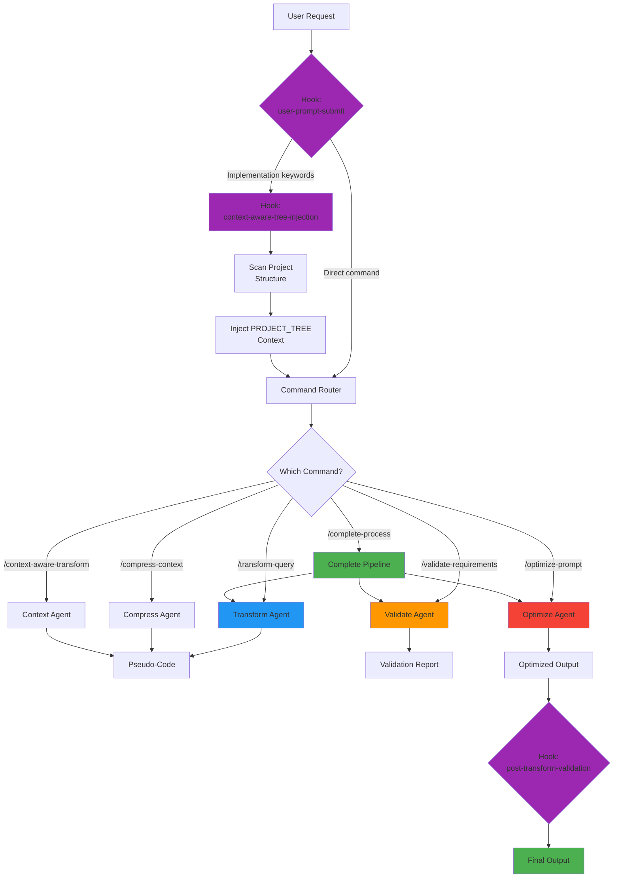
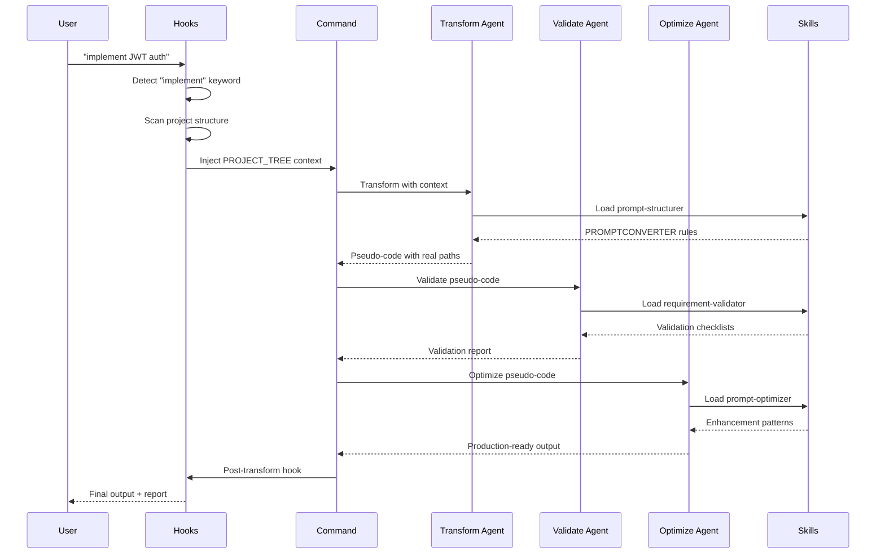

# Plugin Architecture

**Read time: 2 minutes**

## Overview
The plugin transforms natural language into production-ready pseudo-code through a multi-agent pipeline with context-aware project analysis.

## End-to-End Flow



## Component Layers

### Layer 1: Hooks (Auto-Triggered)
| Hook | Trigger | Purpose |
|------|---------|---------|
| `user-prompt-submit` | User input | Detects commands and keywords |
| `context-aware-tree-injection` | Keywords: implement, create, add | Scans project, injects structure |
| `context-compression-helper` | Input >100 words | Suggests compression |
| `post-transform-validation` | After transformation | Auto-validates output |

### Layer 2: Commands (User-Invoked)
| Command | Purpose | Agents Used |
|---------|---------|-------------|
| `/complete-process` | Full pipeline | transformer → validator → optimizer |
| `/transform-query` | Basic transformation | transformer |
| `/compress-context` | Reduce verbosity | compressor |
| `/validate-requirements` | Quality check | validator |
| `/optimize-prompt` | Enhance specs | optimizer |
| `/context-aware-transform` | Architecture-aware | analyzer → transformer |

### Layer 3: Agents (Processing)
| Agent | Specialization | Input → Output |
|-------|----------------|----------------|
| `prompt-transformer` | NL → pseudo-code | Text → Function syntax |
| `context-compressor` | Token reduction | Verbose → Concise |
| `requirement-validator` | Quality assurance | Pseudo-code → Report |
| `prompt-optimizer` | Enhancement | Basic → Production-ready |
| `prompt-analyzer` | Structure analysis | Project tree → Patterns |

### Layer 4: Skills (Capabilities)
| Skill | Knowledge Base | Loaded When |
|-------|----------------|-------------|
| `prompt-structurer` | PROMPTCONVERTER methodology | Transform operations |
| `requirement-validator` | Security/validation checklists | Validation operations |
| `prompt-optimizer` | Enhancement patterns | Optimization operations |
| `context-compressor` | Compression techniques | Large inputs |

## Data Flow

### Example: Complete Process Command


## Directory Structure

```
pseudo-code-prompting-plugin/
├── commands/                    # User-facing commands
│   ├── complete-process.md
│   ├── transform-query.md
│   ├── compress-context.md
│   ├── validate-requirements.md
│   ├── optimize-prompt.md
│   └── context-aware-transform.md
│
├── skills/                      # Capability definitions
│   ├── prompt-structurer/
│   │   ├── capabilities.json
│   │   ├── SKILL.md
│   │   └── references/         # Knowledge base
│   ├── requirement-validator/
│   ├── prompt-optimizer/
│   └── context-compressor/
│
├── hooks/                       # Auto-triggered logic
│   ├── core/
│   │   └── user-prompt-submit.py
│   ├── tree/
│   │   ├── context-aware-tree-injection.py
│   │   └── get_context_tree.py
│   ├── compression/
│   │   └── context-compression-helper.py
│   └── validation/
│       └── post-transform-validation.py
│
└── docs/                        # Documentation (you are here)
    ├── complete-process.md
    ├── transform-query.md
    └── ARCHITECTURE.md
```

## Key Architectural Patterns

### 1. Progressive Loading
Skills load on-demand based on context, not all at once. Reduces memory and token usage.

### 2. Hook-Driven Context
Hooks automatically inject project structure, user can focus on request not context gathering.

### 3. Agent Pipeline
Agents are composable - can run individually or in sequence (complete-process).

### 4. Context Window Optimization
Complete-process removes intermediate outputs, keeping only query + final result (60-80% token reduction).

### 5. Memory Persistence
Session memory survives conversation compaction:
- `.claude/pseudo-code-prompting/activeContext.md` - Current transformations
- `.claude/pseudo-code-prompting/patterns.md` - Learned patterns
- `.claude/pseudo-code-prompting/progress.md` - Quality metrics

## Integration Points

### With Claude Code
- Uses Claude Code's auto-discovery system
- Skills auto-load based on capabilities.json
- Commands registered via frontmatter metadata
- Hooks execute on specified triggers

### With Other Plugins
- Integrates with `feature-dev` workflow
- Outputs compatible with code generation tools
- Can chain with other transformation plugins

## Token Efficiency

| Operation | Tokens Without Plugin | With Plugin | Savings |
|-----------|----------------------|-------------|---------|
| Verbose requirement | 4,200 | 850 | 80% |
| Transform + validate + optimize | 8,000 | 1,600 | 80% |
| Complete process (with cleanup) | 10,000 | 2,000 | 80% |
| Context-aware transform | 6,000 | 1,200 | 80% |

## Performance Characteristics

- **Transform only**: 5-15 seconds
- **Complete process**: 30-90 seconds
- **Context-aware mode**: +5-10 seconds (project scan)
- **Compression**: 10-20 seconds (60-95% size reduction)

## Why This Architecture?

1. **Separation of Concerns** - Hooks, commands, agents, skills each have clear roles
2. **Composability** - Mix and match agents for different workflows
3. **Context-Aware** - Automatic project analysis, not manual context gathering
4. **Token-Efficient** - Progressive loading, output cleanup, compression
5. **Quality-Focused** - Validation and optimization built into pipeline
6. **Developer-Friendly** - Real paths, existing patterns, integration points

## Next Steps

- See individual command docs for usage details
- Check [README.md](../README.md) for installation
- Review [CONTRIBUTING.md](../CONTRIBUTING.md) to extend the plugin
