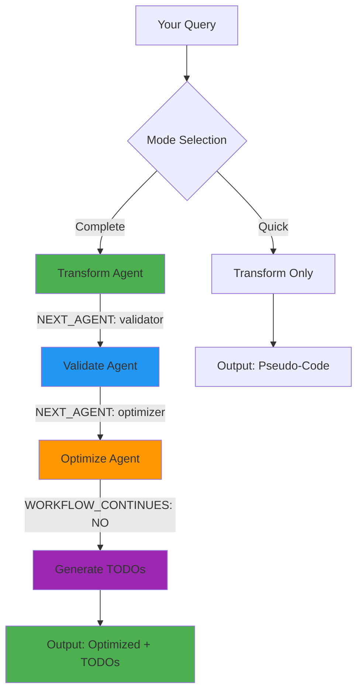

# Complete Process

## What It Does
Runs the full transformation pipeline **fully automatically**: transforms natural language → validates requirements → optimizes pseudo-code → generates implementation TODOs. The entire workflow runs continuously without stops between steps.

## Goal
Save time and ensure quality by automating the complete workflow with structured agent communication, automatic TODO generation, and clean final output ready for implementation.

## When to Use
- Production features requiring validation and optimization
- Complex requirements needing thorough analysis
- When you want best-quality output without manual orchestration

## How to Invoke
```
Run complete-process: implement JWT authentication with refresh tokens
```

or

```
/complete-process implement JWT authentication with refresh tokens
```

## Workflow (Fully Automated)



**Key Feature:** No user intervention between Transform → Validate → Optimize. The workflow runs continuously based on agent output signals.

### Agents Invoked (Automated Chain)
1. **prompt-transformer** - Converts natural language to pseudo-code → Outputs `NEXT_AGENT: validator`
2. **requirement-validator** - Checks completeness and security → Outputs `NEXT_AGENT: optimizer`
3. **prompt-optimizer** - Enhances with missing parameters → Outputs `TODO_LIST` + `WORKFLOW_CONTINUES: NO`

### Orchestrator Behavior
- Reads each agent's output for workflow signals
- Automatically invokes next agent based on `NEXT_AGENT` signal
- Generates implementation TODOs when `WORKFLOW_CONTINUES: NO` is received
- No stops, no manual "continue" prompts

### Hooks Used
- `user-prompt-submit` - Detects command invocation
- `context-aware-tree-injection` - Injects project structure (if available)
- `context-compression-helper` - Suggests compression for large inputs

### Skills
- `prompt-structurer` - Core transformation logic
- `requirement-validator` - Validation rules
- `prompt-optimizer` - Optimization patterns

## Output Example
```javascript
// Input: "implement user login"
// Output after complete process:
implement_user_login(
  auth_method="email_password",
  endpoints={
    "login": "/api/auth/login",
    "logout": "/api/auth/logout"
  },
  security={
    "hashing": "bcrypt",
    "session": "jwt",
    "csrf_protection": true
  },
  rate_limiting="5_attempts_per_15min",
  error_handling={
    "invalid_credentials": "return_401",
    "account_locked": "return_423"
  }
)
```

## Why Use This Command
- **Fully automated** - No stops between Transform → Validate → Optimize steps
- **TODO generation** - Implementation tasks automatically extracted from optimized output
- **Clean output** - Only optimized function presented (no intermediate clutter)
- **60-80% token reduction** - Removes intermediate outputs from context
- **Consistent quality** - Automated validation catches issues
- **Production-ready** - Output includes security, validation, error handling
- **Context-aware** - Uses your actual project structure
- **Implementation-ready** - User can immediately say "start to implement"
