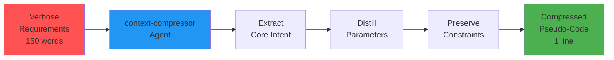

# Compress Context

## What It Does
Transforms verbose, detailed requirements (100+ words) into concise pseudo-code format, reducing token usage by 80-95% while preserving all essential information.

## Goal
Reduce context window bloat and token costs by compressing lengthy requirements into structured, implementation-ready pseudo-code.

## When to Use
- Long feature descriptions (>100 words)
- Detailed specifications that repeat information
- Before running other commands to reduce processing time
- When approaching context limits

## How to Invoke
```
Run compress-context: We need to create a REST API endpoint that handles user registration. The endpoint should accept POST requests at the /api/register path. Users need to provide their email address, which must be validated to ensure it's a proper email format and not already in use...
```

or

```
/compress-context <your verbose requirements>
```

## Workflow



### Agents Invoked
- **context-compressor** - Applies compression algorithms and patterns

### Hooks Used
- `context-compression-helper` - Auto-suggests compression for inputs >100 words

### Skills
- `context-compressor` - Compression patterns and techniques

## Output Example
```javascript
// Input: 158 words about user registration endpoint
// Output: 95% reduction

create_endpoint(
  path="/api/register",
  method="POST",
  request_schema={
    "email": "email:required:unique",
    "password": "string:required:min(12):requires(upper,lower,number,special)"
  },
  password_hash="bcrypt",
  response_codes={
    "201": {"user_id": "string", "created_at": "timestamp"},
    "400": "validation_error",
    "409": "duplicate_email"
  },
  rate_limit={"max": 10, "window": "1h", "key": "ip"}
)

// Compression: 158 words → 1 structured call
// Ratio: 95% reduction
```

## Why Use This Command
- **95% token reduction** - Massive savings on long requirements
- **Zero information loss** - All constraints, security, validation preserved
- **Faster processing** - Compressed input processes 30-50% faster
- **Better clarity** - Structured format eliminates ambiguity
- **Cost savings** - Fewer tokens = lower API costs
