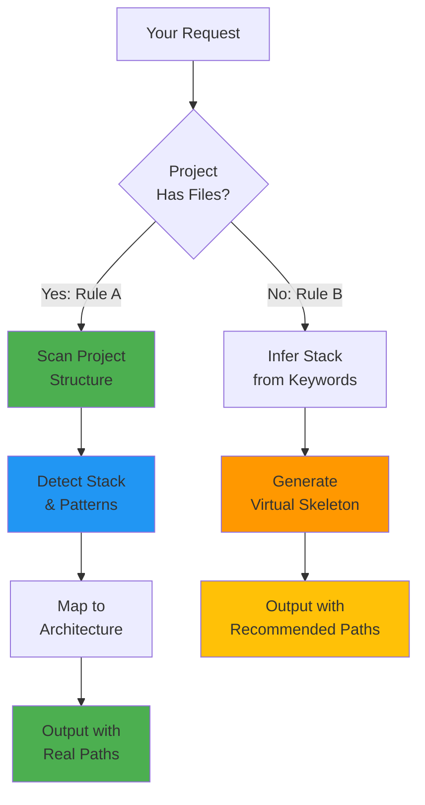

# Context-Aware Transform

## What It Does
Analyzes your project structure and transforms requests with **actual file paths** from your codebase. For empty projects, generates stack-specific virtual skeleton.

## Goal
Provide architecture-aware transformations that reference your real project files, not generic suggestions.

## When to Use
- Implementation requests (implement, create, add, refactor)
- When you want output tailored to your project structure
- Starting new projects (generates recommended structure)

## How to Invoke
```
Run context-aware-transform: add user authentication to the app
```

or

```
/context-aware-transform add user authentication
```

## Workflow



### Agents Invoked
- **prompt-transformer** - Transforms with context awareness
- **prompt-analyzer** - Analyzes project structure

### Hooks Used
- `context-aware-tree-injection` - **Critical** - Scans project and injects structure
- Triggers on keywords: `implement`, `create`, `add`, `refactor`, `build`

### Skills
- `prompt-structurer` - Transformation with project context

## Output Example

### Rule A (Existing Project)
```javascript
// Input: "add JWT authentication"
// Project: Next.js 13+ with TypeScript

implement_authentication(
  type="jwt",
  target_files=[
    "src/lib/auth.ts",                           // ← Real path from your project
    "src/app/api/auth/[...nextauth]/route.ts",   // ← Follows your structure
    "src/components/auth/LoginForm.tsx"          // ← Matches your patterns
  ],
  modifications=["src/app/layout.tsx"],
  stack="nextjs_react",                          // ← Detected from package.json
  follows_pattern="src/lib/utils.ts"             // ← References existing file
)
```

### Rule B (Empty Project)
```javascript
// Input: "create FastAPI user API"
// Project: Empty

create_api(
  framework="fastapi",
  recommended_structure={
    "stack": "python_fastapi",
    "files": [
      "app/api/endpoints/users.py",
      "app/core/config.py",
      "app/models/user.py"
    ]
  }
)
```

## Why Use This Command
- **Real file paths** - Not generic "create auth.js"
- **Architecture-aligned** - Respects your project patterns
- **Stack detection** - Automatically identifies your tech stack
- **Convention-aware** - Follows your naming and organization
- **Smart for empty projects** - Generates proper structure from keywords
