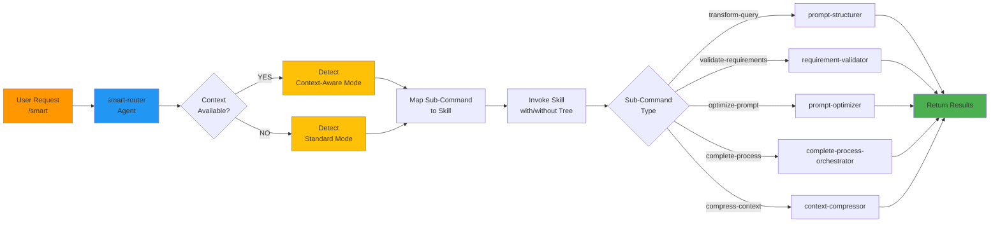

# Smart: Intelligent Router

## What It Does
Intelligent single entry point for all pseudo-code-prompting commands. Automatically detects context-aware mode, reuses cached PROJECT_TREE, and routes to the appropriate sub-command (transform-query, validate-requirements, optimize-prompt, complete-process, or compress-context).

## Goal
Maximize token efficiency (40-70% savings) by intelligently routing commands to cached context when available, eliminating redundant project scanning while maintaining transparent sub-command execution.

## When to Use
- Running multiple commands in one workflow (e.g., transform → validate → optimize)
- Token optimization is a priority
- Want a single command entry point for all operations
- Working with context-aware transformations (automatic tree reuse)
- Multi-step requirements processing pipeline

## How to Invoke
```
Run smart: transform-query Implement user authentication
```

or

```
/smart transform-query Implement user authentication
/smart validate-requirements implement_auth(...)
/smart optimize-prompt implement_auth(...)
```

## Supported Sub-Commands

All five pseudo-code-prompting commands work with smart:

```bash
/smart transform-query [natural language query]
/smart validate-requirements [pseudo-code]
/smart optimize-prompt [pseudo-code]
/smart complete-process [feature request]
/smart compress-context [verbose requirements]
```

## Workflow



### Agents Invoked
- **smart-router** - Routes command to appropriate sub-command skill

### Hooks Used
- `context-aware-tree-injection` - Captures PROJECT_TREE if available
- `user-prompt-submit` - Detects smart invocation

### Skills
- `smart-router` - Routing and context reuse logic
- All sub-command skills (prompt-structurer, requirement-validator, etc.)

## Output Examples

### Example 1: Transform with Cached Context

```bash
Input: /smart transform-query Implement JWT authentication

Output:
implement_jwt_authentication(
  target_files=["src/lib/auth.ts", "src/app/api/auth/route.ts"],
  stack="nextjs_react",
  security=["bcrypt", "jwt_token", "secure_cookies"]
)
```

### Example 2: Multi-Command Workflow

```bash
# Command 1: Transform (reuses cached tree from hooks)
/smart transform-query Implement user registration

# Output: Pseudo-code with file paths

# Command 2: Validate (reuses SAME cached tree, no re-scan)
/smart validate-requirements implement_user_registration(...)

# Output: Validation report with issues

# Command 3: Optimize (reuses SAME cached tree again, no re-scan)
/smart optimize-prompt implement_user_registration(...)

# Output: Enhanced pseudo-code with security/error handling

TOKEN SAVINGS: 40-70% vs running each command separately
```

### Example 3: Full Pipeline

```bash
/smart complete-process Build REST API with PostgreSQL database

Output:
✓ Step 1/3: Transform complete
✓ Step 2/3: Validation passed (2 medium warnings)
✓ Step 3/3: Optimization complete

Optimized: build_rest_api(
  framework="express",
  database="postgresql",
  auth="jwt",
  ...
)

TODOs:
- [ ] Create API endpoints
- [ ] Set up database migrations
- [ ] Implement auth middleware
```

## Token Efficiency Strategy

### How It Works (Option B: Read-Only Cached Tree)

All pseudo-code-prompting commands are **read-only** (no project modification):

| Command | What It Does |
|---------|-------------|
| transform-query | Reads tree → generates pseudo-code |
| validate-requirements | Analyzes code → returns report |
| optimize-prompt | Enhances code → returns optimized |
| complete-process | Full pipeline → returns output |
| compress-context | Reduces text → returns compressed |

**Result:** Tree is captured once by hooks and safely reused across all commands.

### Typical Savings

**Scenario: User runs 3 commands in one session**

**Without smart (separate tree scans):**
```
Command 1: Scan project (2000 tokens) + transform (1500) = 3500 tokens
Command 2: Scan project (2000 tokens) + validate (1200) = 3200 tokens
Command 3: Scan project (2000 tokens) + optimize (1800) = 3800 tokens
Total: 10,500 tokens
```

**With smart (cached tree reuse):**
```
Initial: Tree captured by hooks (0 tokens - automatic)
Command 1: Transform only (1500 tokens) = 1500 tokens
Command 2: Validate only (1200 tokens) = 1200 tokens
Command 3: Optimize only (1800 tokens) = 1800 tokens
Total: 4,500 tokens (57% savings)
```

**Actual Savings Range:** 40-70% depending on project size
- Small projects (<20 files): ~40-50% savings
- Medium projects (20-100 files): ~50-65% savings
- Large projects (100+ files): ~65-80% savings

## Context-Aware Mode Detection

Smart automatically detects when PROJECT_TREE is available:

**Checks for both markers:**
1. `[CONTEXT-AWARE MODE ACTIVATED]` - From context-aware-tree-injection hook
2. `PROJECT_TREE` or `Project Structure:` - Cached tree structure

**Decision Logic:**
- If BOTH found → Use context-aware mode (include tree)
- If EITHER missing → Use standard mode (no tree)

**Context Sources:**
- Detected automatically when using implementation keywords (implement, create, add, build)
- Persists across multiple commands in same session
- Auto-clears when switching projects

## Error Handling

### Invalid Sub-Command
```
❌ Error: Unknown sub-command "validate"
Available commands:
  - transform-query
  - validate-requirements
  - optimize-prompt
  - complete-process
  - compress-context
```

### Missing Arguments
```
❌ Error: Missing arguments for transform-query
Usage: /smart transform-query [query text]
```

### Sub-Command Failure
```
❌ Sub-command failed: transform-query error

Details: Query too ambiguous

Try:
1. Add more specific details
2. Use /smart compress-context first to refine requirements
```

## Performance

| Metric | Value |
|--------|-------|
| Routing latency | <100ms |
| Context detection | <50ms |
| Total overhead | <500ms |
| Token savings | 40-70% |
| Supports | All 5 sub-commands |

## Why Use This Command

✅ **Save Tokens** - 40-70% reduction on multi-command workflows

✅ **Single Entry Point** - One command for all operations

✅ **Transparent** - Results passed through without modification

✅ **Smart Context** - Automatic detection and reuse

✅ **Backward Compatible** - Original commands still work

✅ **Error Handling** - Graceful fallback to standard mode

## Compared to Running Commands Separately

| Aspect | Separate | Smart |
|--------|----------|-------|
| Entry point | 5 different commands | 1 unified command |
| Tree scans | Repeated per command | Cached once, reused |
| Token cost | Full scan each time | Saved 40-70% |
| Speed | Slower (re-scans) | Faster (reuse) |
| Context awareness | Individual | Shared across workflow |
| User experience | Remember each command | Simple `/smart` routing |

## Real-World Workflow

**Building a REST API with smart:**

```bash
# 1. Get the requirement
User: "Build REST API for user management with JWT auth and PostgreSQL"

# 2. Compress if too verbose (optional)
/smart compress-context [long requirement] → Concise input

# 3. Transform to pseudo-code
/smart transform-query [concise input]
→ Pseudo-code with real file paths (tree reused from hooks)

# 4. Validate completeness
/smart validate-requirements [pseudo-code]
→ Report: "Missing rate limiting" (tree reused)

# 5. Optimize for production
/smart optimize-prompt [pseudo-code]
→ Enhanced: "Added rate_limiting={...}" (tree reused)

# 6. Implement based on specs
→ Use pseudo-code to write actual code

TOTAL TOKEN COST: ~4,500 tokens (vs 10,500 without smart)
TIME SAVED: ~30-40% faster due to no re-scanning
CONTEXT REUSE: 3 reuses of same cached PROJECT_TREE
```

## Integration with Other Features

### Works with Complete-Process
```bash
/smart complete-process [feature]

→ Full pipeline (transform → validate → optimize)
→ All 3 steps reuse same cached context
→ Returns optimized output + TODOs
```

### Works with Compress-Context
```bash
/smart compress-context [long requirements]
→ Compressed output

/smart transform-query [compressed output]
→ Pseudo-code
```

### Works with Context-Aware Mode
```bash
# When project context is available:
/smart transform-query [query]
→ Output includes real file paths from project

# Automatic in context-aware projects
```

## Tips & Tricks

### Maximize Token Savings
1. Run `/smart transform-query` first (triggers tree capture if available)
2. Then run `/smart validate-requirements` (reuses tree)
3. Then run `/smart optimize-prompt` (reuses tree again)
4. **Result:** All 3 steps reuse same cached tree

### Workflow Chains
```bash
# Chain 1: Quick iteration
/smart transform-query [v1]
/smart validate-requirements [v1]

# Chain 2: Production readiness
/smart transform-query [v2]
/smart validate-requirements [v2]
/smart optimize-prompt [v2]

# Both chains reuse single cached PROJECT_TREE
```

### Fallback Behavior
- If PROJECT_TREE not available → Runs in standard mode (still works, just no context-aware optimization)
- No errors, graceful degradation
- Project context auto-resets when switching projects (prevents stale data)

## When NOT to Use Smart

- When running a single command (use original command directly)
- When you don't need project context (tree reuse saves less)
- When switching between different projects (context auto-resets)

In these cases, original commands work fine and have same functionality.

## Related Commands

| Related | Use When |
|---------|----------|
| [complete-process](complete-process.md) | Full pipeline in one step |
| [transform-query](transform-query.md) | Just need basic transformation |
| [validate-requirements](validate-requirements.md) | Just need quality check |
| [optimize-prompt](optimize-prompt.md) | Just need enhancement |
| [compress-context](compress-context.md) | Need to reduce verbose input |
| [context-aware-transform](context-aware-transform.md) | Need architecture-aware analysis |

## See Also

- **[ARCHITECTURE.md](ARCHITECTURE.md)** - How smart integrates into system
- **[README.md](../README.md)** - Main plugin documentation
