# Validate Requirements

## What It Does
Analyzes pseudo-code to identify missing parameters, security gaps, edge cases, and ambiguous requirements. Quality check before implementation.

## Goal
Catch incomplete specifications early by validating completeness, security, error handling, and performance requirements.

## When to Use
- After transformation, before implementation
- To identify security vulnerabilities
- When pseudo-code seems too simple
- Before passing specs to developers

## How to Invoke
```
Run validate-requirements: create_user(email, password)
```

or

```
/validate-requirements create_user(email, password)
```

## Workflow

```mermaid
flowchart TD
    A[Pseudo-Code] --> B[requirement-validator<br/>Agent]
    B --> C[Check<br/>Security]
    C --> D[Check<br/>Validation]
    D --> E[Check Error<br/>Handling]
    E --> F[Check<br/>Performance]
    F --> G{Issues<br/>Found?}
    G -->|Yes| H[⚠️ Report<br/>with Fixes]
    G -->|No| I[✓ Pass]

    style H fill:#FF5252
    style I fill:#4CAF50
    style B fill:#2196F3
```



### Agents Invoked
- **requirement-validator** - Comprehensive validation checks

### Hooks Used
- `post-transform-validation` - Can auto-trigger after transformation

### Skills
- `requirement-validator` - Validation checklists and patterns

## Output Example
```javascript
// Input: Basic pseudo-code
create_user(email, password)

// Output: Validation Report
Requirement Validation Report
━━━━━━━━━━━━━━━━━━━━━━━━━━━━━━

✗ CRITICAL ISSUES
- Missing authentication check
- No password hashing specified
- No email validation rules
- Missing error responses

⚠ WARNINGS
- No rate limiting on user creation
- Timeout values not defined
- No audit logging specified

📋 EDGE CASES TO CONSIDER
- Duplicate email handling
- Invalid email format
- Weak password handling
- Account verification flow

💡 RECOMMENDATIONS
- Add auth parameter
- Specify bcrypt for password hashing
- Define email validation (RFC5322)
- Add rate_limit="10/hour/ip"

Overall Status: BLOCKED
```

## Why Use This Command
- **Catches security gaps** - Identifies missing auth, validation
- **Prevents bugs** - Spots edge cases before coding
- **Improves quality** - Ensures completeness
- **Saves rework** - Fix specs, not code
- **Learning tool** - Shows what professional specs need
